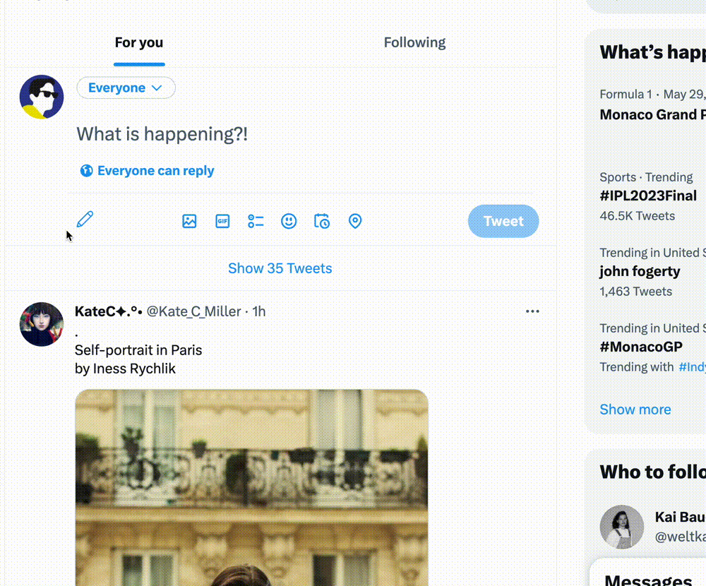

#  Twitter Long Text Editor

**280 characters? We can do more!**

Twitter Long Text Editor is a powerful Chrome extension that convert the input long text into an image and directly write it to the **clipboard** 📋.

*Say good bye to Musk's **$8** long-text service. You can now freely create and share your ideas without any restrictions.*

## Features

- Powerful rich text editing function.
- One-click to write long text and copy the image to clipboard.

## Install

1. Directly from Chorme extension store (not yet)
2. Download the release zip [package](https://github.com/Gaochengzhi/Twitter-long-text/releases) and install manually 

## Contribution

This project was bootstrapped with [Chrome Extension CLI](https://github.com/dutiyesh/chrome-extension-cli)

For further develop, please read their docs

Rich text editor is supported by [Quilljs](https://quilljs.com/) and text convertion with [http-to-image](https://github.com/bubkoo/html-to-image/)
